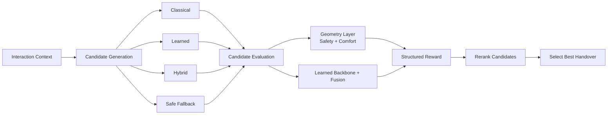
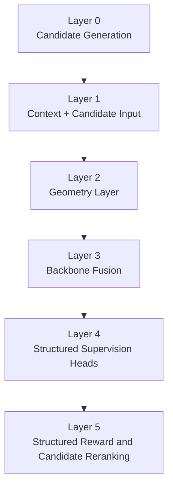
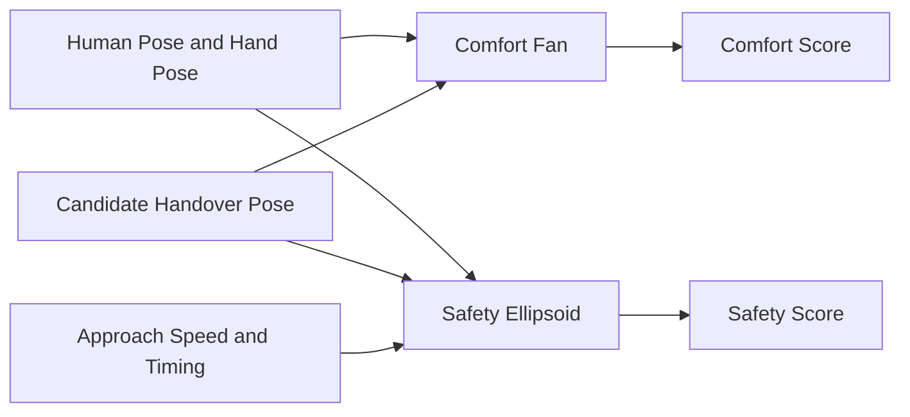
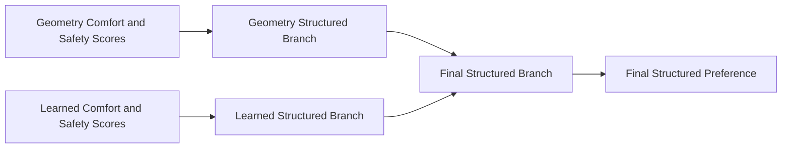
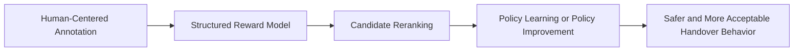

# Structured Reward Modeling for Complex Human-Robot Handover

This repository studies a simple question with a difficult answer:

**when a robot hands an object to a person in a crowded, constrained, and reactive scene, what makes one handover behavior better than another from the human side?**

The project reframes handover from a pure motion-planning problem into a **structured reward modeling** problem centered on **human preference**, with safety as a gate and comfort as the optimization objective.

Instead of asking the model to produce an end-to-end policy directly, the current prototype asks it to:

```text
understand one interaction context
-> compare multiple candidate handover behaviors
-> score them with structured reward
-> rerank and select the most acceptable one
```

Detailed design notes, schema references, and annotation templates are grouped under:

- [Documentation Hub](docs/README.md)

## 1. The Story Of The Project

In classical robot handover, success is usually measured with metrics such as:

- task completion
- collision avoidance
- feasibility
- efficiency

These metrics are necessary, but they are not enough.

A handover can be technically successful and still feel wrong. The robot may approach too fast, stop too close, present the object at an awkward angle, or force the human into a stretch, lean, or repositioning behavior that makes the interaction feel unsafe or uncomfortable.

This project focuses on that missing layer:

**how to model handover quality in a way that reflects human preference, not only task success.**

## 2. From Motion Planning To Preference-Centered Reranking

The key reformulation is this:

the native problem is **not**

```text
trajectory A vs trajectory B -> which one wins
```

The native problem is:

```text
context + candidate_set -> structured reward -> rerank/select
```

Pairwise comparisons still exist, but only as a training view exported from a candidate set. The actual system is **candidate-first** and **context-centered**.

This matters because real robot systems do not act on isolated preference pairs. They act on:

- a person
- a robot state
- a local environment
- a task goal
- a set of locally feasible behaviors

## 3. System Logic At A Glance



The logic is intentionally hierarchical:

1. understand the scene
2. produce feasible candidates
3. judge each candidate through explicit geometry and learned representation
4. combine those signals into structured reward
5. select the best safe-and-comfortable option

## 4. The Core Design Choice: Safety Gates, Comfort Optimizes

The V2 main path keeps only two primary reward dimensions:

- `safety`
- `comfort`

This is not because other dimensions are unimportant. It is because the current prototype concentrates on the two dimensions that most directly decide whether a handover is acceptable.

The reward is hierarchical rather than a flat weighted sum:

```text
structured_score = comfort_score - lambda_veto * ReLU(tau_safe - safety_score)^2
```

Interpretation:

- safety is the prerequisite
- comfort matters inside the safe region
- high comfort cannot compensate for severe safety failure

This captures a very human judgment pattern:

**a handover is not good because it is comfortable if it already feels unsafe.**

## 5. The Internal Architecture

The project can be understood as a six-stage system.



Each layer has a clear role.

### Layer 0. Candidate generation

The model assumes that one context produces multiple feasible handover candidates. In the synthetic V2 path, each context includes:

- `classical`
- `learned`
- `hybrid`
- `safe_fallback`

This means the reward model is not replacing the generator. It is judging and reranking what the generator proposes.

### Layer 1. Context and candidate input

The model reads:

- human state
- robot initial state
- environment summary
- task goal
- candidate trajectories
- handover pose and timing

This creates a representation of both the situation and the available options.

### Layer 2. Geometry layer

An explicit geometry layer evaluates each candidate with human-centered geometric rules:

- a **comfort fan**
- a **safety ellipsoid**

These provide interpretable comfort and safety anchors.

### Layer 3. Backbone fusion

A learned backbone encodes trajectory behavior, and a fusion head combines:

- segment embeddings
- context features
- candidate auxiliary features
- geometry features

This is where explicit structure and learned representation meet.

### Layer 4. Structured supervision heads

The system does not predict only one preference label. It predicts a bundle of supervision signals:

- overall preference
- reason label
- reaction label
- comfort-better label
- safety-better label
- optional score targets
- optional subreason labels

### Layer 5. Structured reward and reranking

Finally, the model constructs a structured reward signal and turns it into candidate ranking behavior.

## 6. Why Geometry Matters

One of the most important ideas in this repository is that human preference is not treated as a pure black box.

The project explicitly models two geometric priors:

- **ComfortFanModule**
- **SafetyEllipsoidModule**

The comfort fan approximates where a handover pose feels natural relative to the human hand, body orientation, and reachable zone.

The safety ellipsoid approximates a human-centered safety boundary around the body and combines spatial intrusion with speed-related risk.

Conceptually:



This makes the reward interpretable:

- comfort is not a vague hidden variable
- safety is not just a binary collision check
- both are grounded in geometry that can be inspected, debugged, and learned

## 7. From Fixed Rules To Trainable Geometry

The project has already moved through three geometry stages:

1. fixed geometry
2. trainable global geometry
3. trainable contextual geometry

That progression is central to the project story.

### Fixed geometry

This is the hand-crafted baseline. The system uses manually chosen comfort and safety parameters as an interpretable ruler.

### Trainable global geometry

This learns one shared ruler from data. Instead of forcing all parameters to stay fixed, the model learns a globally improved comfort zone and safety boundary.

### Trainable contextual geometry

This is the strongest current prototype. The geometry parameters are allowed to adapt to the local context using:

- local handover geometry
- compact environment summary
- shared context encoding
- separate comfort and safety adapters

This means the notion of a good handover zone is no longer universal. It becomes:

- scene-aware
- obstacle-aware
- context-conditioned

That is a major step toward making preference structure both learnable and explainable.

## 8. Data Is Organized Around Context, Not Around Pairs

The native V2 data unit is a **context record**.


Each context record contains:

- one interaction context
- multiple candidates under that context
- pairwise training comparisons sampled from the same candidate set

This preserves the true reranking problem shape while still supporting pairwise training.

## 9. What The Model Learns To Predict

The project uses structured supervision rather than a single scalar label.

### Required supervision

- `overall_preference`
- `reason_label`
- `reaction_label`
- `comfort_better_label`
- `safety_better_label`

### Optional supervision

- `comfort_score_target`
- `safety_score_target`
- `safety_subreason_label`
- `comfort_subreason_label`

The labels are carefully designed.

The most important design choice is that **reason is defined from the loser perspective**:

> in this A/B comparison, what is the worse candidate mainly worse at?

This makes explanations more stable and closer to how humans often describe interaction failures.

The subreason heads are also pair-conditioned and loser-conditioned. They are not generic per-trajectory attributes. They explain why one candidate loses relative to another.

## 10. How Explicit And Learned Signals Work Together

The model maintains three structured branches:

- geometry branch
- learned branch
- final branch



The current fusion is geometry-dominant:

```text
final_structured = 0.8 * geometry_structured + 0.2 * learned_structured
```

This is a deliberate choice.

At the prototype stage, geometry acts as the stable anchor and learned signals act as refinement. The system is therefore not fully hand-crafted and not fully black-box. It is a structured compromise between interpretability and flexibility.

## 11. Why Synthetic Data Is Programmatic

The synthetic pipeline is designed to produce **internally consistent supervision**, not just realistic-looking examples.

The project explicitly avoids free-form generation of geometry truth. Instead, synthetic labels are generated programmatically so that:

- comfort-better labels match comfort score ordering
- safety-better labels match safety score ordering
- reason labels match the loser defect pattern
- reaction labels are tied to failure modes
- hierarchical reward logic is enforced consistently

This is essential because structured reward supervision only works when the labels agree with each other.

## 12. Real Data Strategy

The real-data path is intentionally staged.

Phase 1 real data does **not** require every fine-grained target. It only requires the core pairwise supervision:

- overall preference
- reason
- reaction
- comfort-better
- safety-better

Fine-grained numeric score targets and subreason labels may be missing.

This is a practical design choice. It lets the project start collecting real human judgment before the annotation burden becomes too heavy.

## 13. What The Current Prototype Already Delivers

The current repository already contains a working end-to-end prototype for:

- candidate-first schema design
- synthetic candidate-set generation
- data validation and readiness checks
- pairwise export from context-level records
- explicit geometry-based comfort and safety scoring
- trainable global and contextual geometry
- learned fusion heads and structured supervision
- hierarchical structured reward computation
- debugging, ablation, and checkpointed training

In other words, the repository is already beyond a concept note. It is a functioning research prototype that connects:

```text
data schema -> synthetic generation -> loader -> model -> training -> debugging
```

## 14. Current Boundary Of The Project

This repository should be read as a **structured reward modeling prototype**, not as a final deployment stack.

It is currently positioned as:

- a candidate reranker
- a candidate selector
- a local refinement guide

It is not yet the final:

- end-to-end control policy
- online motion planner
- full real-world robot evaluation stack

That boundary is important, because the project is deliberately building the reward side first so that future policy learning has a stronger signal to learn from.

## 15. The Long-Term Research Path

The broader trajectory of the project is:



So the current prototype is not the end goal. It is the foundation.

The long-term idea is that once the model can reliably score and explain handover behavior, it can supervise:

- better candidate selection
- better candidate refinement
- future reinforcement learning or policy optimization

## 16. Recommended Reading Order

If you want to understand the project in the same order that its internal logic unfolds, read it like this:

1. start from the problem reformulation in the top half of this README
2. understand why the system is candidate-first rather than pair-first
3. understand why safety and comfort are the two main reward dimensions
4. understand why geometry is explicit instead of hidden inside a network
5. understand why trainable contextual geometry is a key upgrade
6. understand why the labels are structured and loser-conditioned
7. understand why synthetic data must be programmatic
8. then move to implementation details and experiments

For the detailed supporting documents, use:

- [docs/README.md](docs/README.md)

## 17. In One Sentence

This project builds a **candidate-first, geometry-grounded, human-preference-centered structured reward model** for complex robot handover, with **safety as a gate, comfort as the optimization target, and explainability as a first-class design goal**.
