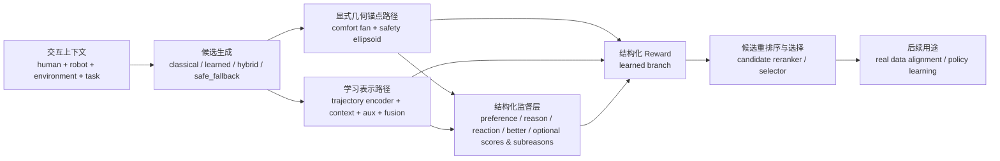
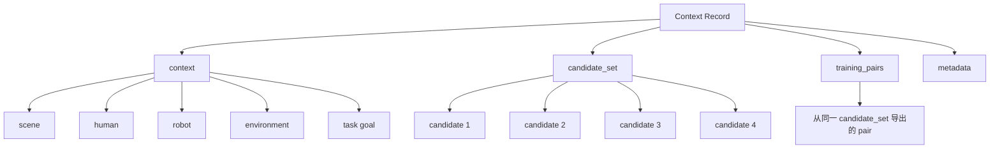

# 面向复杂人机交互递物场景的结构化 Reward Modeling

这个仓库围绕一个看似简单、但其实很难回答的问题展开：

**当机器人在拥挤、受限、并且人会产生隐式反应的场景中向人递物时，什么样的交互行为才是真正更好的？**

本项目将 handover 从一个单纯的运动规划问题，重构为一个以**人类偏好**为中心的**结构化 reward modeling** 问题：以安全为门槛，以舒适为优化目标，用结构化方式对候选行为进行评分、解释与重排序。

当前原型并不直接学习端到端控制策略，而是先解决更基础、也更关键的一步：

```text
理解一个交互上下文
-> 比较多个候选递物行为
-> 用结构化 reward 对它们打分
-> 重排序并选出更可接受的方案
```

更详细的设计说明、数据 schema 和标注模板可见：

- [文档总览](docs/README.md)

## 1. 项目的问题背景

在传统机器人递物系统中，常见优化目标包括：

- 任务完成
- 避障
- 可行性
- 效率

这些目标当然重要，但它们并不足以完整描述真实的人机交互质量。

一个 handover 可以在技术上成功，但依然让人感觉“不对”。例如，机器人可能接近得太快、停得太近、递物角度别扭，或者让人不得不额外伸手、扭转、探身、重新调整姿势。这些行为在传统指标下未必算失败，但从人的体验来看，交互质量已经明显下降。

本项目关注的正是这部分缺失的问题：

**如何用一种真正反映人类偏好的方式，对 handover 行为进行评分，而不是只看任务是否完成。**

## 2. 从运动规划到偏好中心的候选重排序

本项目最核心的问题重构是：

真正的目标**不是**

```text
给定轨迹 A 和轨迹 B -> 判断谁更好
```

真正的目标是：

```text
context + candidate_set -> structured reward -> rerank/select
```

也就是说，A/B pair 仍然存在，但它只是从候选集导出的训练视图，而不是系统本体。系统本身是**候选优先**、**上下文中心**的。

这很重要，因为真实机器人系统面对的从来不是一对孤立偏好样本，而是：

- 一个具体的人
- 一个机器人当前状态
- 一个局部环境
- 一个任务目标
- 一组在当前场景下局部可行的候选行为

## 3. 系统整体逻辑

下面这张图是本项目的**唯一主结构图**。它把项目里最关键的部分放在同一张图里：

- 问题输入是什么
- 候选是怎么来的
- 几何锚点和学习主干如何协同
- 模型到底预测哪些结构化信号
- structured reward 怎么形成
- 为什么最终目标是重排序而不是直接端到端控制
- 这个 reward model 后续如何服务真实数据和策略学习

```text
┌─────────────────────────────────────────────────────────────────────────────────────────────────────────────────────────────┐
│                                                面向复杂人机交互递物的结构化 Reward 总图                                      │
├─────────────────────────────────────────────────────────────────────────────────────────────────────────────────────────────┤
│ 输入层：交互上下文                                                                                                            │
│ 人体状态 / 手部位置 / 身体朝向 / 机器人初始状态 / 局部环境 / 障碍摘要 / 可达区域 / 任务目标 / 场景类型                      │
└─────────────────────────────────────────────────────────────────────────────────────────────────────────────────────────────┘
                                                         │
                                                         ▼
┌─────────────────────────────────────────────────────────────────────────────────────────────────────────────────────────────┐
│ 候选生成层：在同一 context 下生成多个局部可行候选                                                                              │
│ classical candidate          learned candidate          hybrid candidate          safe_fallback candidate                      │
└─────────────────────────────────────────────────────────────────────────────────────────────────────────────────────────────┘
                                                         │
                                                         ▼
┌───────────────────────────────────────────────┬─────────────────────────────────────────────────────────────────────────────┐
│ 显式几何锚点路径                              │ 学习表示与融合路径                                                           │
│                                               │                                                                             │
│ ComfortFanModule                              │ Trajectory Encoder                                                           │
│ - 递物半径                                    │ - 编码候选轨迹时序行为                                                       │
│ - 前方扇区角                                  │                                                                             │
│ - 上下舒适带                                  │ Context Features                                                             │
│ - 伸手/姿态代价                               │ - 人 / 机 / 环境 / 任务联合表征                                              │
│                                               │                                                                             │
│ SafetyEllipsoidModule                         │ Candidate Auxiliary Features                                                 │
│ - 人体中心安全边界                            │ - 候选来源 / handover pose / timing / feasibility flags                      │
│ - 空间侵入风险                                │                                                                             │
│ - 接近速度风险                                │ Fusion Head                                                                  │
│ - 时间窗速度风险                              │ - 融合 trajectory / context / aux / geometry                                 │
│                                               │                                                                             │
│ 输出：                                         │ 输出：                                                                      │
│ comfort_score_geom                            │ comfort_score_pred                                                           │
│ safety_score_geom                             │ safety_score_pred                                                            │
│ 几何 violation 特征                           │ pair embedding                                                               │
│ 可解释几何参数                                │ learned preference signals                                                   │
└───────────────────────────────────────────────┴─────────────────────────────────────────────────────────────────────────────┘
                                  │                                                             │
                                  └──────────────────────────────┬──────────────────────────────┘
                                                                 ▼
┌─────────────────────────────────────────────────────────────────────────────────────────────────────────────────────────────┐
│ 结构化监督层                                                                                                                  │
│ overall_preference / reason_label / reaction_label / comfort_better_label / safety_better_label                              │
│ optional: comfort_score_target / safety_score_target / safety_subreason / comfort_subreason                                   │
│ 说明：reason 与 subreason 采用 loser-conditioned、pair-conditioned 语义                                                       │
└─────────────────────────────────────────────────────────────────────────────────────────────────────────────────────────────┘
                                                         │
                                                         ▼
┌─────────────────────────────────────────────────────────────────────────────────────────────────────────────────────────────┐
│ 结构化 Reward 层                                                                                                              │
│                                                                                                                               │
│ 几何分支：segment_score_structured_geom = comfort_geom - veto(safety_geom)                                                    │
│ 学习分支：segment_score_structured_learned = comfort_pred - veto(safety_pred)                                                 │
│ 最终分支：final_structured = alpha_geom * geometry + alpha_learned * learned                                                  │
│                                                                                                                               │
│ 核心原则：Safety Gates, Comfort Optimizes                                                                                     │
│ structured_score = comfort_score - lambda_veto * ReLU(tau_safe - safety_score)^2                                              │
└─────────────────────────────────────────────────────────────────────────────────────────────────────────────────────────────┘
                                                         │
                                                         ▼
┌─────────────────────────────────────────────────────────────────────────────────────────────────────────────────────────────┐
│ 输出层：候选重排序与选择                                                                                                      │
│ 在同一 context 的 candidate_set 中选出更安全、更舒适、更可接受的 handover 方案                                                │
│ 系统定位：candidate reranker / selector / local refinement guide                                                              │
└─────────────────────────────────────────────────────────────────────────────────────────────────────────────────────────────┘
                                                         │
                                                         ▼
┌─────────────────────────────────────────────────────────────────────────────────────────────────────────────────────────────┐
│ 后续研究路径                                                                                                                  │
│ real / weakly-real annotation -> structured reward model -> candidate reranking -> policy learning / policy improvement      │
└─────────────────────────────────────────────────────────────────────────────────────────────────────────────────────────────┘
```



整套系统可以概括成一句话：

**在一个具体交互场景中，先生成多个候选递物方案，再用几何锚点和学习表示共同构造结构化 reward，最终在安全门控下优化舒适性，并将其用于候选重排序与后续策略学习。**

围绕这张图，可以按下面这个顺序理解项目：

1. 先理解场景
2. 再提出多个可行候选
3. 对每个候选同时进行显式几何判断和学习式表示建模
4. 将这些信号合成为结构化 reward
5. 最终选出更安全、更舒适的方案
6. 再把这个 reward model 接回真实数据和未来策略学习

## 4. 核心设计：安全先过门槛，舒适再做优化

V2 主路径只保留两个核心 reward 维度：

- `safety`
- `comfort`

这并不是说别的维度不重要，而是当前原型优先聚焦于最直接决定 handover 可接受性的两个核心维度。

同时，这两个维度的关系不是平权加和，而是分层关系：

```text
structured_score = comfort_score - lambda_veto * ReLU(tau_safe - safety_score)^2
```

它的含义是：

- 安全是前提
- 舒适是在安全范围内的优化目标
- 高舒适性不能抵消严重的安全缺陷

这比简单加权和更符合人的判断逻辑：

**一个 handover 不会因为“很舒服”就自动变成“好方案”，如果它本身已经让人感觉不安全。**

## 5. 项目的内部架构

整个项目可以理解为一个六层系统，但这些层已经被整合进上面的唯一主图中。下面只对每层的职责做文字说明，不再重复画分散结构图。

每一层都有清晰的职责。

### 第 0 层：候选生成

系统假设每个 context 对应多个 handover 候选。在当前的 V2 synthetic 路径中，每个 context 至少包含：

- `classical`
- `learned`
- `hybrid`
- `safe_fallback`

这意味着 reward model 并不是替代候选生成器，而是负责判断和重排序它提出的候选。

### 第 1 层：上下文与候选输入

模型读取的信息包括：

- 人体状态
- 机器人初始状态
- 环境摘要
- 任务目标
- 候选轨迹
- 递物位姿与时机

这一步构造的是“情境 + 备选行为”的联合表示，而不是孤立地看一条轨迹。

### 第 2 层：几何层

这里引入两个显式几何模块：

- **comfort fan**
- **safety ellipsoid**

它们为舒适性和安全性提供可解释的几何锚点。

### 第 3 层：主干融合

学习主干对轨迹进行编码，fusion head 再融合：

- segment embedding
- context features
- candidate auxiliary features
- geometry features

这一步是显式结构先验与学习表示真正结合的地方。

### 第 4 层：结构化监督头

系统不是只预测一个 preference 标签，而是同时预测一组结构化监督信号：

- overall preference
- reason label
- reaction label
- comfort-better label
- safety-better label
- 可选 score target
- 可选 subreason 标签

### 第 5 层：结构化 Reward 与重排序

最后，模型将这些信息合成为结构化 reward，并将其用于候选排序与选择。

## 6. 为什么几何层如此重要

本项目最关键的思想之一，就是**不把人类偏好完全交给黑箱网络**。

系统显式建模了两个几何先验：

- **ComfortFanModule**
- **SafetyEllipsoidModule**

其中，comfort fan 用来近似描述：相对于人的手部、身体朝向和可达区域，什么样的递物位置更自然、更舒服。

safety ellipsoid 用来近似描述：围绕人体的一个安全边界，并结合空间侵入程度和速度风险来刻画安全性。

这样一来，reward 就具有了明确的解释性：

- comfort 不再是模糊的隐藏变量
- safety 不再只是简单的碰撞检测
- 两者都被落在可以检查、调试、学习的几何结构上

## 7. 从固定规则到可学习几何

这个项目在几何层上已经经历了三个阶段：

1. 固定几何
2. 全局可学习几何
3. 上下文可学习几何

这条演化线是项目的重要主线之一。

### 固定几何

这是最初的手工 baseline。系统使用人工设定的舒适区域和安全边界，作为一把可解释的标尺。

### 全局可学习几何

这一步不再把标尺完全固定，而是从数据中学习一套全局共享的舒适区和安全边界参数。

### 上下文可学习几何

这是当前最强的原型。几何参数不再是全局统一的，而是可以根据局部 context 动态调整，利用的信息包括：

- 局部 handover 几何
- 紧凑环境摘要
- 共享 context 编码
- 分开的 comfort / safety adapter

这意味着“好的递物区域”不再是全局通用常数，而是变成了：

- 场景感知的
- 障碍感知的
- context-conditioned 的

这一步非常关键，因为它让偏好边界变成既可学习、又可解释的对象。

## 8. 数据组织围绕 Context，而不是围绕 Pair

V2 的原生数据单元是一个 **context record**，不是一个孤立 pair。

```text
一个 context
-> 包含 scene / human / robot / environment / task goal
-> 对应一个 candidate_set
-> 再从同一个 candidate_set 中导出 training_pairs
```

### 数据结构示意图

```text
┌─────────────────────────────────────┐
│ Context Record                      │
├─────────────────────────────────────┤
│ context                             │
│   - scene                           │
│   - human                           │
│   - robot                           │
│   - environment                     │
│   - task goal                       │
├─────────────────────────────────────┤
│ candidate_set                       │
│   - candidate 1                     │
│   - candidate 2                     │
│   - candidate 3                     │
│   - candidate 4                     │
├─────────────────────────────────────┤
│ training_pairs                      │
│   - 从同一 candidate_set 导出的 pair │
├─────────────────────────────────────┤
│ metadata                            │
└─────────────────────────────────────┘
```



每条 context record 都包含：

- 一个交互上下文
- 在该上下文下的多个候选方案
- 从同一个候选集里抽出的 pairwise 训练比较

这样既保留了真实 reranking 问题的形状，也能兼容 pairwise 训练。

## 9. 模型到底学什么

本项目采用的是结构化监督，而不是单一标量标签。

### 必需监督

- `overall_preference`
- `reason_label`
- `reaction_label`
- `comfort_better_label`
- `safety_better_label`

### 可选监督

- `comfort_score_target`
- `safety_score_target`
- `safety_subreason_label`
- `comfort_subreason_label`

这些标签的设计是有语义结构的。

其中最重要的一点是：**reason 从 loser 视角定义**。

也就是说：

> 在当前 A/B 比较中，输掉的那个 candidate 主要输在什么地方？

这种设计比“赢家为什么赢”更稳定，也更接近人在交互中描述失败体验的方式。

此外，subreason 也是 pair-conditioned、loser-conditioned 的。它不是单条轨迹的静态属性，而是在解释“为什么这条比另一条差”。

## 10. 显式信号与学习信号如何协同

系统维护三条 structured branch：

- 几何分支
- 学习分支
- 最终分支

当前的融合方式是 geometry-dominant 的：

```text
final_structured = 0.8 * geometry_structured + 0.2 * learned_structured
```

这是一个刻意的设计。

在原型阶段，几何分支提供稳定锚点，学习分支提供细化能力。也就是说，系统既不是完全手工规则，也不是完全黑箱，而是在可解释性与灵活性之间做了结构化折中。

## 11. 为什么 Synthetic 数据必须程序化生成

本项目的 synthetic pipeline 追求的不是“看起来像真实数据”，而是**内部监督逻辑一致**。

因此，项目明确避免用自由文本方式随意写出几何真值，而是程序化生成，使得：

- comfort-better 与 comfort score 排序一致
- safety-better 与 safety score 排序一致
- reason 与 loser 的主要缺陷一致
- reaction 与失败模式一致
- 层级 reward 逻辑在全数据中保持一致

这非常重要，因为结构化 reward 学习最怕的就是标签之间相互打架。

## 12. 真实数据策略

真实数据路径是分阶段设计的。

在第一阶段，真实数据**不要求**每条样本都有完整的细粒度标签。最低要求只包括核心 pairwise 监督：

- overall preference
- reason
- reaction
- comfort-better
- safety-better

更细的 score target 和 subreason 可以缺失。

这是一个非常务实的设计选择。它让项目可以尽早接入真实人类判断，而不会因为标注负担过高而卡死。

## 13. 当前原型已经实现了什么

当前仓库已经具备一个完整的研究原型闭环，包括：

- candidate-first schema 设计
- synthetic candidate set 生成
- 数据验证与 readiness 检查
- 从 context-level record 到 pairwise sample 的导出
- 显式几何 comfort / safety 打分
- 全局与上下文可学习几何
- 学习融合头与结构化监督
- 层级 structured reward 计算
- 调试、ablation 与 checkpoint 训练

换句话说，这个仓库已经不是概念草图，而是一个真正跑通的数据到模型原型：

```text
数据 schema -> synthetic 生成 -> loader -> 模型 -> 训练 -> 调试
```

## 14. 项目的当前边界

这个仓库应当被理解为一个**结构化 reward modeling 原型**，而不是最终部署系统。

它当前定位为：

- candidate reranker
- candidate selector
- local refinement guide

它目前还不是最终的：

- 端到端控制策略
- 在线运动规划器
- 完整真实机器人评测系统

这个边界非常重要，因为项目当前的目标是先把 reward 侧建稳，为后续 policy learning 提供高质量监督信号。

## 15. 长期研究路径

```text
人类中心标注
-> 结构化 reward 模型
-> 候选重排序
-> 策略学习 / 策略优化
-> 更安全、更舒适、更可接受的 handover 行为
```

所以，当前原型不是终点，而是基础层。

长期来看，一旦系统能够稳定地对 handover 行为进行评分和解释，它就可以进一步服务于：

- 更好的候选选择
- 更好的候选 refinement
- 后续强化学习或策略优化

## 16. 推荐阅读顺序

如果你想按照项目内部逻辑来理解它，推荐顺序是：

1. 先理解本 README 前半部分中的问题重构
2. 再理解为什么系统是 candidate-first 而不是 pair-first
3. 再理解为什么 safety 和 comfort 是两个主 reward 维度
4. 再理解为什么 geometry 必须显式存在，而不能全放进黑箱
5. 再理解为什么 contextual trainable geometry 是一个关键升级
6. 再理解为什么标签是 structured、loser-conditioned 的
7. 再理解为什么 synthetic 数据必须程序化生成
8. 最后再进入实现细节与实验部分

## 17. 一句话总结

本项目构建的是一个**候选优先、几何锚定、以人类偏好为中心的结构化 reward 模型**，其核心思想是：**以安全为门槛，以舒适为优化目标，并将可解释性作为一等设计原则。**
